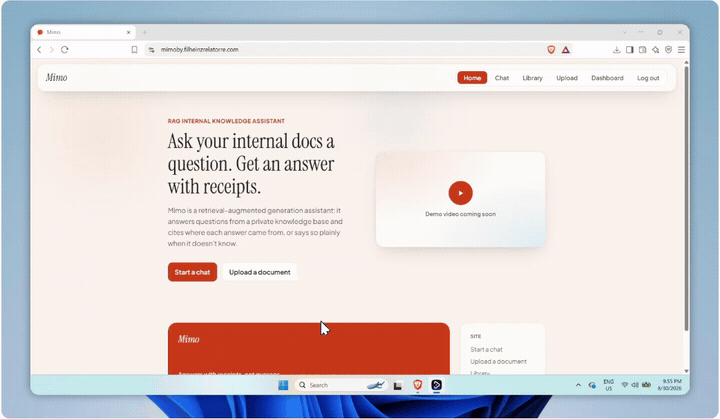
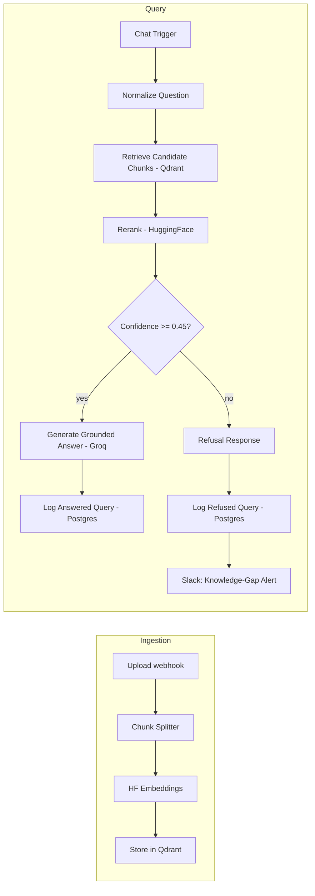

# Mimo - RAG-Powered Internal Knowledge Assistant

Employees waste time re-asking questions that are already answered in company docs. Mimo retrieves the right passage from a private knowledge base and answers with a citation instead of a guess - refusing to answer when it isn't confident, rather than hallucinating.

[](https://mimo-one-delta.vercel.app)


<br>

<!-- HERO: short GIF (10-15s) of asking a question in /chat, the grounded answer
     streaming in with a visible [n] citation, then one more question that should
     trigger the refusal path (something not in the knowledge base) to show that half
     of the pitch too - grounded-or-refuses is the whole point. Save as docs/demo.gif,
     add here as: -->
<!-- <p align="center"></p> -->

**Live demo:** [mimo-one-delta.vercel.app](https://mimo-one-delta.vercel.app) - [chat](https://mimo-one-delta.vercel.app/chat) · [upload](https://mimo-one-delta.vercel.app/upload) · [library](https://mimo-one-delta.vercel.app/library) · [dashboard](https://mimo-one-delta.vercel.app/dashboard) (sign up for a free account to try it)

## Highlights

- **Grounded RAG pipeline** - vector retrieval → cross-encoder reranking → confidence-gated generation, with per-claim `[n]` citations and an explicit refusal path instead of hallucinated answers on low-confidence retrieval.
- **Measured prompt-injection resistance** - retrieved content is treated as untrusted data in the system prompt design, verified with a 12-case adversarial test suite (direct jailbreaks, indirect injection via a planted payload, obfuscated extraction, meta-manipulation).
- **Real authentication and role-based access control** - custom email/password auth issuing signed JWTs (no third-party auth vendor), with retrieval-level enforcement: documents marked admin-only are filtered out of a regular user's results server-side, not just hidden in the UI.
- **Eval-driven, not vibes-driven** - a 30-question ground-truth set plus the adversarial suite run against the live production system, with a documented ablation (confidence threshold 0.5 → 0.45) showing a measured before/after tradeoff, not a guess.
- **Live observability** - a dashboard reading real production logs: query volume, refusal rate, latency percentiles, and a Slack alert fired automatically whenever the assistant can't find an answer (a live signal for knowledge-base gaps).

## Results

Measured against the live production system (not a local mock):

| Metric | Result |
|---|---|
| Retrieval accuracy (expected document in top-4 reranked chunks) | **100%** (25/25) |
| Prompt-injection resistance (adversarial suite) | **100%** (12/12) |
| False-refusal rate, after a diagnosed threshold fix | 12% → **8%** |
| Citation present in answer | 88% → **92%** |
| Expected-fact keyword coverage | 78% → **84%** |

The threshold fix was found by pulling raw reranker scores from the retrieval pipeline's execution history rather than trusting the final answer text - the false refusals all pointed to the same document, correctly retrieved and ranked #1 every time, just scoring under the original confidence cutoff.

## Architecture



Auth, chat, upload, library, and the dashboard endpoint all run as one orchestrated n8n workflow, gated per-route by JWT verification and role checks.

| Layer | Implementation |
|---|---|
| Orchestration | n8n (self-hosted, Docker) |
| LLM | Groq (Llama 3.3 70B) |
| Embeddings | Hugging Face Inference API (`BAAI/bge-small-en-v1.5`) |
| Vector DB | Qdrant (self-hosted, Docker) |
| Reranker | HuggingFace cross-encoder reranking |
| Frontend | Vite/React - landing, chat, upload, library, dashboard, login, signup |
| Logging | Postgres (Neon) - `query_logs` table backing the dashboard |
| Alerting | Slack, fired on low-confidence refusal |
| Auth / RBAC | Salted HMAC-SHA256 password hashing + server pepper, HS256 JWTs, `admin`/`member` roles enforced at the retrieval layer |

## Repo layout

- `frontend/` - the Vite/React app (landing, chat, upload, library, dashboard pages).
- `seed/` - standalone Node scripts (`ingest.js`, `query.js`) for chunking, embedding, and querying a local Qdrant instance in isolation, plus the eval harness behind the results above.
- `n8n/` - `mimo-workflow.json`, the exported n8n workflow, plus `generate-secrets.js` for generating the auth secrets it needs.

## Local setup

**Frontend:**
```bash
cd frontend
cp .env.example .env   # points at the production n8n webhooks by default
npm install
npm run dev
```

**Seed / retrieval sandbox** (requires a local Qdrant container and a Hugging Face token in `../.env` as `HF=...`):
```bash
docker run -d --name qdrant -p 6333:6333 -p 6334:6334 -v qdrant_storage:/qdrant/storage qdrant/qdrant
cd seed
npm install
node ingest.js
node query.js
```

## Known limitations

- Password hashing is salted HMAC-SHA256 with a server-side pepper rather than bcrypt/scrypt/argon2 - deliberately scoped for this project's size, not intended for a large production user base as-is.
- No password reset flow, no email verification, no login rate-limiting yet.
- Ingestion is a manual upload rather than a scheduled sync from an external source (e.g. Google Drive).
- Retrieval is vector-only; hybrid vector + keyword search is a natural next step.

## Changelog

- **2026-07-29** - The signup/login password-hashing nodes (`Hash Password (Signup)`, `Hash Submitted Password (Login)`) previously ran HMAC with no key configured, which silently drops the security benefit of using HMAC at all. Both nodes are now bound to a dedicated n8n `crypto` credential holding the server-side pepper, so signup and login use the identical keyed hash. **Note:** if any accounts were registered before this fix, their stored password hash was computed unkeyed and will no longer match on login - those accounts need a password reset.

---

## About the developer

**Fil Heinz O. Re La Torre** - Automation & AI Solutions Engineer, building integrations and AI-backed workflows that go from idea to production in days.

[](https://www.filheinzrelatorre.com)
[](https://ph.linkedin.com/in/filheinzrelatorre)
[](https://github.com/jabluetooth)
[](mailto:filheinz27@gmail.com)

**Other projects:** [Match](https://github.com/jabluetooth/match) · [ZeroPress](https://github.com/jabluetooth/zeropress) · [Insight](https://github.com/jabluetooth/insight) · [Se7en](https://github.com/jabluetooth/se7en) · [see all →](https://github.com/jabluetooth)

## License

MIT - see [LICENSE](LICENSE)
