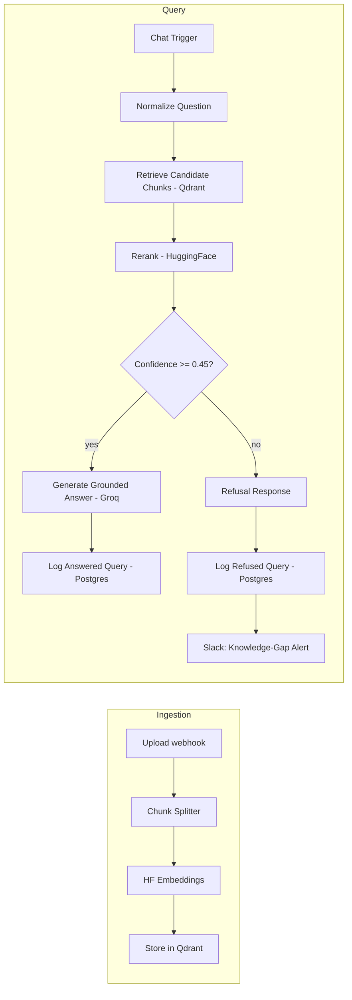

# Mimo - RAG-Powered Internal Knowledge Assistant

Employees waste time re-asking questions that are already answered in company docs. Mimo retrieves the right passage from a private knowledge base and answers with a citation instead of a guess - refusing to answer when it isn't confident, rather than hallucinating.

[](https://mimoby.filheinzrelatorre.com)
[](https://github.com/jabluetooth/mimo/actions/workflows/ci.yml)


<br>

<p align="center"></p>

**Live demo:** [mimoby.filheinzrelatorre.com](https://mimoby.filheinzrelatorre.com) - [how it works](https://mimoby.filheinzrelatorre.com/how-it-works) · [security](https://mimoby.filheinzrelatorre.com/security) · [run your own](https://mimoby.filheinzrelatorre.com/run-your-own) · [chat](https://mimoby.filheinzrelatorre.com/chat) · [upload](https://mimoby.filheinzrelatorre.com/upload) · [library](https://mimoby.filheinzrelatorre.com/library) · [dashboard](https://mimoby.filheinzrelatorre.com/dashboard) (sign up for a free account to try it)

## Highlights

- **Grounded RAG pipeline** - vector retrieval (8 candidates) → re-scoring against the question → role filter → confidence-gated generation over the top 4, with per-claim `[n]` citations and an explicit refusal path instead of hallucinated answers on low-confidence retrieval.
- **Measured prompt-injection resistance** - retrieved content is treated as untrusted data in the system prompt design, verified with a 12-case adversarial test suite (direct jailbreaks, indirect injection via a planted payload, obfuscated extraction, meta-manipulation).
- **Real authentication and role-based access control** - custom email/password auth issuing signed JWTs (no third-party auth vendor), with retrieval-level enforcement: documents marked admin-only are filtered out of a regular user's results server-side, not just hidden in the UI.
- **Eval-driven, not vibes-driven** - a 30-question ground-truth set plus the adversarial suite run against the live production system, with a documented ablation (confidence threshold 0.5 → 0.45) showing a measured before/after tradeoff, not a guess.
- **Live observability** - a dashboard reading real production logs: query volume, refusal rate, latency percentiles, and a Slack alert fired automatically whenever the assistant can't find an answer (a live signal for knowledge-base gaps).

## Results

Measured against the live production system (not a local mock), July 2026:

| Metric | Result |
|---|---|
| Retrieval accuracy (expected document in top-4 reranked chunks) | **100%** (25/25) |
| Prompt-injection resistance (adversarial suite) | **100%** (12/12) |
| False-refusal rate, after a diagnosed threshold fix | 12% → **8%** |
| Correct-refusal rate, the cost of that fix | 100% → **80%** (one should-refuse question now answered at 0.47) |
| Citation present in answer | 88% → **92%** |
| Expected-fact keyword coverage | 78% → **84%** |

The threshold fix was found by pulling raw reranker scores from the retrieval pipeline's execution history rather than trusting the final answer text - the false refusals all pointed to the same document, correctly retrieved and ranked #1 every time, just scoring under the original confidence cutoff.

**September 2026 re-run: a hidden reliability failure, found and fixed.** Re-running the eval with a corrected scorer (see Changelog) showed that **7 of 30 questions came back as an empty reply** when asked back to back - the old scorer had been counting those as answers. Re-asked 20 seconds apart, all 7 were answered correctly from the right document, which pinned the cause on Groq's per-minute rate limit: the workflow was swallowing the error. The generation step now retries (3 tries, 5 s apart) and falls back to an explicit "busy, try again" reply instead of an empty one.

| Back-to-back run, 30 questions | Before retry | After retry |
|---|---|---|
| Empty replies | 23% (7/30) | **0%** |
| Retrieval accuracy | 64% | **92%** |
| Citation present | 64% | **92%** |
| Expected-fact coverage | 60% | **86%** |
| p95 latency | 4.9 s | 11.5 s (the retries waiting out the rate limit) |

The two remaining misses are the same false refusals as in July, and one should-refuse question ("office wifi password") is still answered - both tracked as known gaps.

## Tests

```bash
npm test   # 85 tests, well under a second, no network or services; Node 22.18+
```

CI runs them on every push (`.github/workflows/ci.yml`, alongside the frontend build). Zero dependencies: Node's built-in test runner, and Node's native TypeScript support for the one frontend file.

| File | Covers |
|---|---|
| `tests/workflow-security.test.mjs` | The n8n workflow's wiring, checked on the exported graph: every protected endpoint verifies the JWT before anything else runs, admin routes check the role and 403 otherwise, JWTs are pinned to HS256 and expire, login/signup are rate-limited before any credential check, every SQL value is a bound parameter, and nothing reaches the LLM without passing the 0.45 confidence gate |
| `tests/code-nodes.test.mjs` | The workflow's Code nodes, run from the real export: constant-time password compare, re-scoring and citation numbering, role-based retrieval (a member never gets an admin-only chunk, and their confidence is computed from visible chunks only), and the document library |
| `tests/eval-scoring.test.mjs` | The eval harness's scorer and offline re-scoring |
| `tests/api-fetch.test.mjs` | The frontend's single API seam (`frontend/src/lib/apiFetch.ts`) |

Testing the exported workflow means a change made in the n8n editor and re-exported is exactly what the tests check; a re-wired connection or a changed IF node fails CI instead of shipping silently.

## Architecture



Auth, chat, upload, library, and the dashboard endpoint all run as one orchestrated n8n workflow, gated per-route by JWT verification and role checks.

| Layer | Implementation |
|---|---|
| Orchestration | n8n (self-hosted, Docker) |
| LLM | Groq (`openai/gpt-oss-120b`, temperature 0.2) |
| Embeddings | Hugging Face Inference API (`sentence-transformers/all-mpnet-base-v2`) |
| Vector DB | Qdrant (self-hosted, Docker) |
| Re-scoring | Hugging Face sentence similarity (`all-mpnet-base-v2`) between the question and each candidate |
| Frontend | Vite/React, Tailwind CSS v4, Framer Motion - landing, how it works, security, run your own, chat, upload, library, dashboard, login, signup |
| Logging | Postgres (Neon) - `query_logs` table backing the dashboard |
| Alerting | Slack, fired on low-confidence refusal |
| Auth / RBAC | Salted HMAC-SHA256 password hashing + server pepper, HS256 JWTs, `admin`/`member` roles enforced at the retrieval layer |

## Repo layout

- `frontend/` - the Vite/React app (landing, chat, upload, library, dashboard pages).
- `seed/` - standalone Node scripts (`ingest.js`, `query.js`) for chunking, embedding, and querying a local Qdrant instance in isolation, plus the eval harness behind the results above.
- `n8n/` - `mimo-workflow.json`, the exported n8n workflow, plus `generate-secrets.js` for generating the auth secrets it needs.

## Local setup

**Frontend:**
```bash
cd frontend
cp .env.example .env   # points at the production n8n webhooks by default
npm install
npm run dev
```

**Seed / retrieval sandbox** (requires a local Qdrant container and a Hugging Face token in `../.env` as `HF=...`):
```bash
docker run -d --name qdrant -p 6333:6333 -p 6334:6334 -v qdrant_storage:/qdrant/storage qdrant/qdrant
cd seed
npm install
node ingest.js
node query.js
```

## Known limitations

- Password hashing is salted HMAC-SHA256 with a server-side pepper rather than bcrypt/scrypt/argon2 - deliberately scoped for this project's size, not intended for a large production user base as-is.
- No password reset flow and no email verification yet. (Sign-in is rate-limited: 10 attempts per email per 15 minutes, 5 sign-ups per email per hour.)
- Ingestion is a manual upload rather than a scheduled sync from an external source (e.g. Google Drive).
- Retrieval is vector-only; hybrid vector + keyword search is a natural next step.

## Changelog

- **2026-09-25** - Added the test suite above, which found and fixed an access-control gap: the document library endpoint verified the JWT but not the role, so any signed-in member could see the file names of admin-only documents (never their contents; chat retrieval was already filtered). `Aggregate By Source` now applies the same role rule as chat retrieval. Deployed to the live instance.
- **2026-09-25** - The generation step now retries on failure and replies with a `busy` status instead of an empty body; the chat UI shows it as "Busy, try again" and the eval scores it as an error. Took back-to-back empty replies from 23% to 0%.
- **2026-09-25** - Fixed two blind spots in the eval scorer (`seed/eval/score.js`), found by re-checking a September run by hand: it missed the model's native `【1】` citations and any fact written with typographic spacing (`50 %`, `90 days`), and it counted an empty reply (the workflow erroring) as a normal answer. Empty replies are now their own `error` outcome, and `node seed/eval/rescore.js` re-scores stored runs without calling production. The July results above re-score identically.
- **2026-09-23** - Rebuilt the website on the same design system as [Relay](https://github.com/jabluetooth/relay) and [Insight](https://github.com/jabluetooth/insight): Tailwind v4 tokens, Framer Motion (masked line reveals, a scroll-driven pipeline, section navigation), Lucide icons, Geist type, in Mimo's own paper-and-vermilion palette with a dark fallback. New How it works, Security and Run your own pages; the home page replays real answers from the eval run, plots the eval's real confidence scores against the gate, and demonstrates the role filter. The app pages (chat, library, upload, dashboard) share one app bar with role-aware navigation; their behaviour is unchanged. GSAP and the 1,400-line stylesheet are gone. This README's architecture table was also corrected to match `n8n/mimo-workflow.json` (embedding model, re-scoring method, LLM, and the sign-in rate limit that already exists).

- **2026-07-29** - The signup/login password-hashing nodes (`Hash Password (Signup)`, `Hash Submitted Password (Login)`) previously ran HMAC with no key configured, which silently drops the security benefit of using HMAC at all. Both nodes are now bound to a dedicated n8n `crypto` credential holding the server-side pepper, so signup and login use the identical keyed hash. **Note:** if any accounts were registered before this fix, their stored password hash was computed unkeyed and will no longer match on login - those accounts need a password reset.

---

## About the developer

**Fil Heinz O. Re La Torre** - Automation & AI Solutions Engineer, building integrations and AI-backed workflows that go from idea to production in days.

[](https://www.filheinzrelatorre.com)
[](https://ph.linkedin.com/in/filheinzrelatorre)
[](https://github.com/jabluetooth)
[](mailto:filheinz27@gmail.com)

**Other projects:** [Match](https://github.com/jabluetooth/match) · [ZeroPress](https://github.com/jabluetooth/zeropress) · [Insight](https://github.com/jabluetooth/insight) · [Se7en](https://github.com/jabluetooth/se7en) · [see all →](https://github.com/jabluetooth)

## License

MIT - see [LICENSE](LICENSE)
