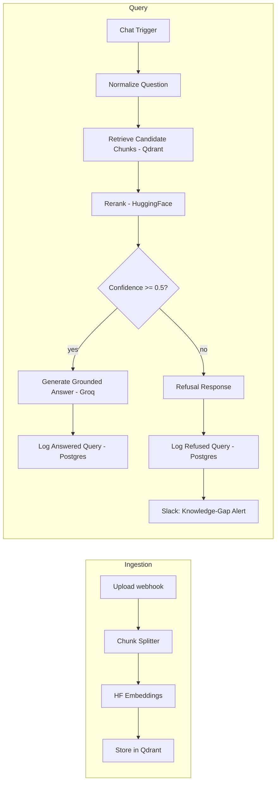

# Mimo — Internal Knowledge Assistant (RAG-powered)

Employees waste time re-asking questions that are already answered in company docs; Mimo retrieves the right passage from your knowledge base and answers with a citation instead of a guess. Full requirements in [PRD-RAG-Internal-Assistant.md](PRD-RAG-Internal-Assistant.md).

**Live demo:** https://mimo-one-delta.vercel.app ([chat](https://mimo-one-delta.vercel.app/chat) · [upload](https://mimo-one-delta.vercel.app/upload) · [library](https://mimo-one-delta.vercel.app/library))

**Demo video:** not recorded yet.

## Architecture



Everything above is a single active n8n workflow ("Mimo RAG - Combined Workflow"), not separate sub-workflows as originally scoped in the PRD — the split-out "RAG Ingestion Workflow" and "RAG List Documents Workflow" exist but are deprecated/inactive in favor of the combined one.

| Layer | Actual implementation |
|---|---|
| Orchestration | n8n (self-hosted, Docker) |
| LLM | **Groq** (Llama 3.3 70B via `lmChatGroq`) — PRD originally specified Claude; switched to Groq |
| Embeddings | Hugging Face Inference API (`BAAI/bge-small-en-v1.5`) |
| Vector DB | Qdrant (self-hosted, Docker) |
| Reranker | HuggingFace rerank endpoint via HTTP Request node |
| Frontend | Vite/React, 4 pages: landing, chat (`@n8n/chat` widget), upload, library — deployed on Vercel |
| Logging | Postgres (`Log Answered Query` / `Log Refused Query`) |
| Knowledge-gap alerting | Slack node fired on refusal |

The generation system prompt enforces grounded-only answers, per-claim `[n]` citations, explicit ambiguity surfacing, and treats retrieved content as untrusted data (prompt-injection defense) — see FR-9–FR-12 in the PRD.

## Status vs. PRD milestones (§9)

| # | Milestone | Status |
|---|---|---|
| 1 | Ingestion: chunk → embed → Qdrant | ✅ done, but via manual upload webhook, not scheduled Google Drive sync (FR-1/FR-3 gap) |
| 2 | Query: retrieval → rerank → grounded answer → citations → injection defense | ✅ done |
| 3 | Slack/Teams bot (primary) + web chat widget (secondary) | ⚠️ web chat widget only — no Slack/Teams bot interface yet |
| 4 | Logging + monitoring dashboard + knowledge-gap alerting | ⚠️ logging and knowledge-gap alerting done; no dashboard UI yet |
| 5 | Eval set + adversarial subset + ablation report | ✅ 30 questions + 12 adversarial cases against production, plus a confidence-threshold ablation (0.5 vs 0.45) with a real before/after delta (see [SCORECARD.md](SCORECARD.md)) |
| 6 | Public scorecard writeup | ✅ [SCORECARD.md](SCORECARD.md) — 100% retrieval accuracy, 100% injection resistance, false-refusal rate improved 12%→8% via a diagnosed and applied threshold fix |
| 7 | n8n workflow published to community template library | ❌ not started |
| 8 | Documentation (this file) | 🚧 in progress — missing demo video, ablation numbers |

Hybrid (vector + keyword) retrieval from FR-6 is also not implemented — retrieval is vector-only, with reranking as the quality safeguard.

## Repo layout

- `frontend/` — the Vite/React app (landing, chat, upload, library pages). See [frontend/README.md](frontend/README.md) for local setup and env vars.
- `seed/` — standalone Node scripts (`ingest.js`, `query.js`) that chunk sample markdown docs, embed them via the HF API, and upsert/query a local Qdrant instance. Useful for testing the retrieval logic in isolation, without touching the production n8n workflow or its Qdrant collection.
- `PRD-RAG-Internal-Assistant.md` — full requirements doc.

## Local setup

**Frontend:**
```bash
cd frontend
cp .env.example .env   # points at the production n8n webhooks by default
npm install
npm run dev
```

**Seed / retrieval sandbox** (requires a local Qdrant container and a Hugging Face token in `../.env` as `HF=...`):
```bash
docker run -d --name qdrant -p 6333:6333 -p 6334:6334 -v qdrant_storage:/qdrant/storage qdrant/qdrant
cd seed
npm install
node ingest.js
node query.js
```

The n8n workflow itself ("Mimo RAG - Combined Workflow") runs on the author's own n8n instance and isn't yet exported into this repo for others to import (tracked under Milestone 7 above).
